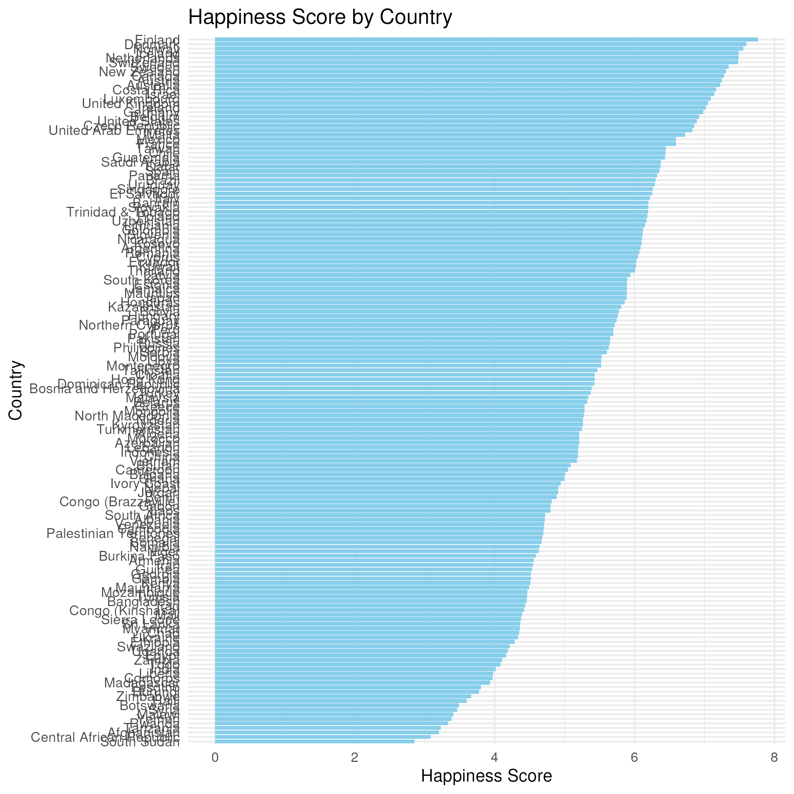
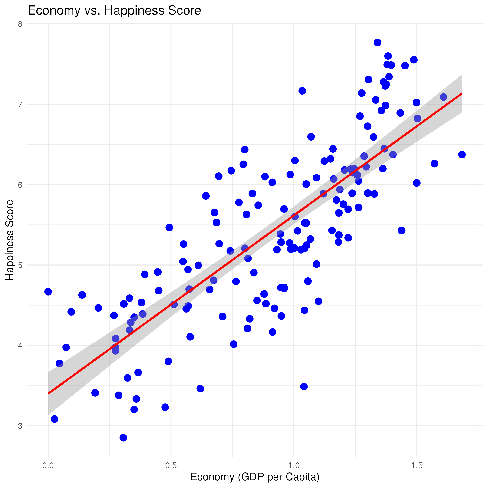
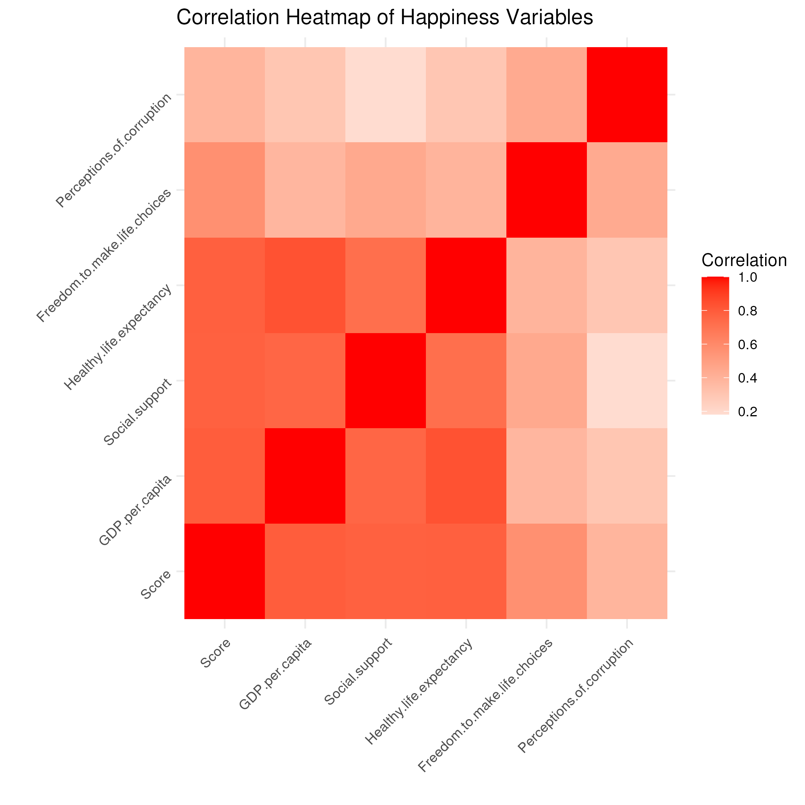
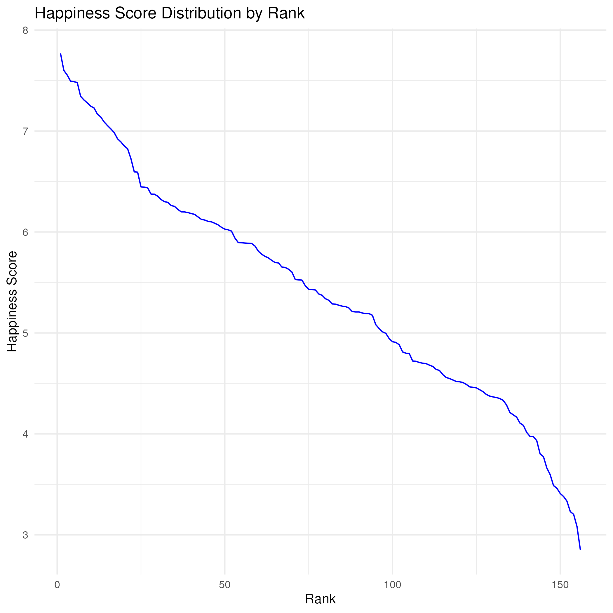
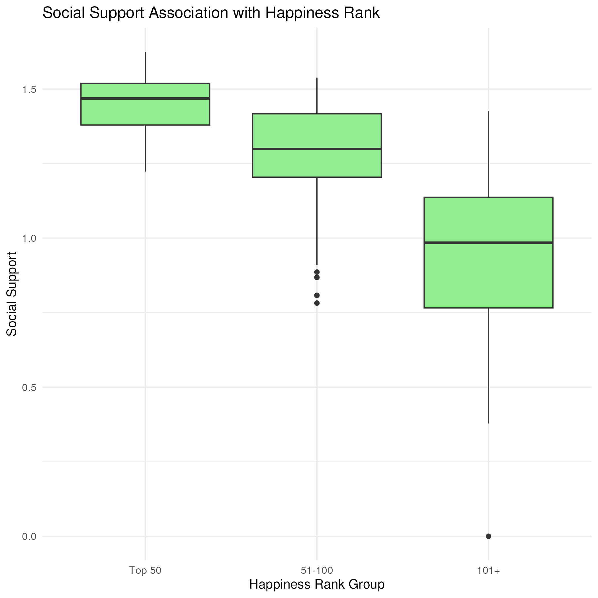

```{r setup, include=FALSE}
knitr::opts_chunk$set(echo = TRUE)
```


This graph depicts what the happiness score for each country is, by ranking countries by their happy scores in order from highest score to lowest score. Finland has the highest score out of all other countries and South Sudan has the lowest score.  


Economy and happiness are directly correlated. As shown by the graph, as country's happiness scores increase, their GDP per capita also subsequently increases. 


#The heatmap is visually depicting pairwise correlations between the different variables in the dataset. By using colors to show the strength and direction of correlation, the graph depicts what variables have a positive correlation, negative correlation, and no correlation. Positive correlations are shown by the strength of the color red to demonstrate that as the score for one variable increases, the other variable score also tends to increase. While negative correlation is shown by the color blue to indicate that as one variable score increases, the other decreases, there are no variables in the dataset that have a negative correlation with each other. Darker blue or red indicates a stronger correlation between variables. The color white indicates that there is no correlation between two variables.
#Some interesting insights from this correlation map include the positive correlation between GDP and happiness score along with GDP and healthy life expectancy. I am particularly surprised that the happiness score was not associated with freedom to make life choices. I thought that greater autonomy would definitely increase ones happiness score since people have greater control over life decisions. 


#This graph depicts the distribution of happiness scores by rank of country. Among the first 25 countries with the highest scores, each subsequent score drops pretty significantly with each country that follows. Between the countries that rank between 25 to 125, the scores don't drop as drastically with each country that follows. However, around 125, the distribution of scores begins to drop pretty significantly again. It seems that there is more of a difference in scores between the first 25 countries and then between 125 and 157 countries. 


#The boxplot is demonstrating the variability of social support scores within each rank group set. There are three rank groups, one for the first top 50 scores, 51-100 scores, and then 101+ scores. Higher ranked countries, in the top 50 set, have higher median social support scores. There is also an NA group for countries that have reported that scores are not available. The first set of countries have lower variability in their social support scores and there are no outliers. Furthermore, the median is higher than any of the other sets of ranks. The 51-100 rank is second highest and there is slightly more variability in scores, with a few outliers. The third set, 101+, has the greatest variability in scores but there are no outliers. As depicted with the graph, there is an association between increased social support and increased happiness scores.